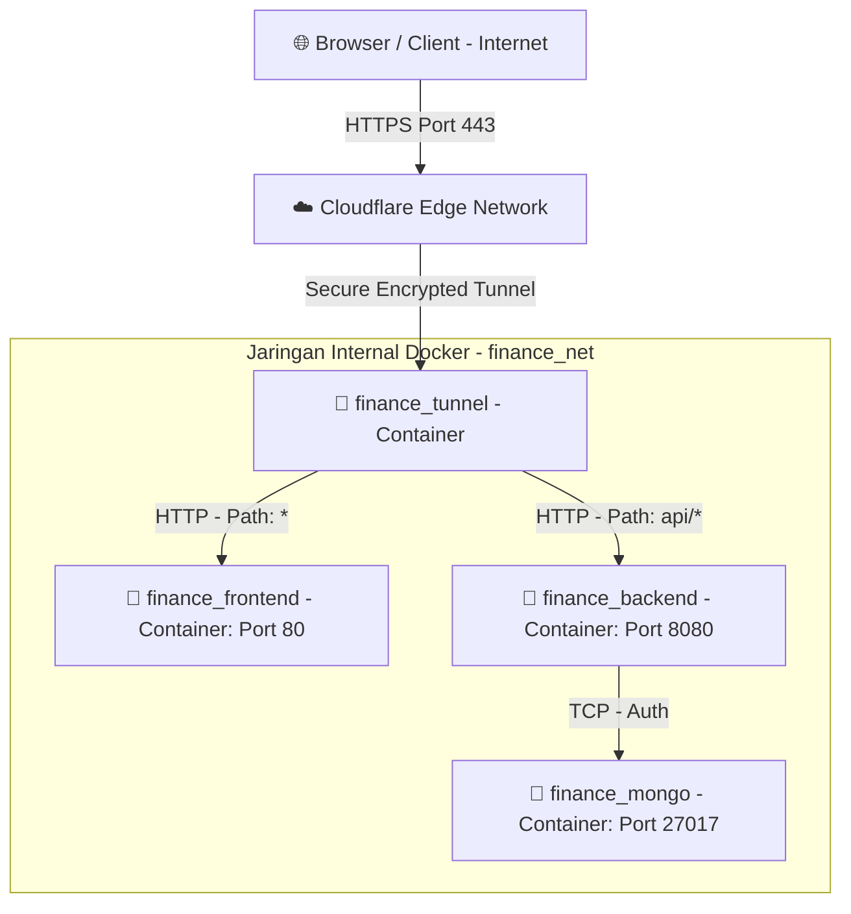
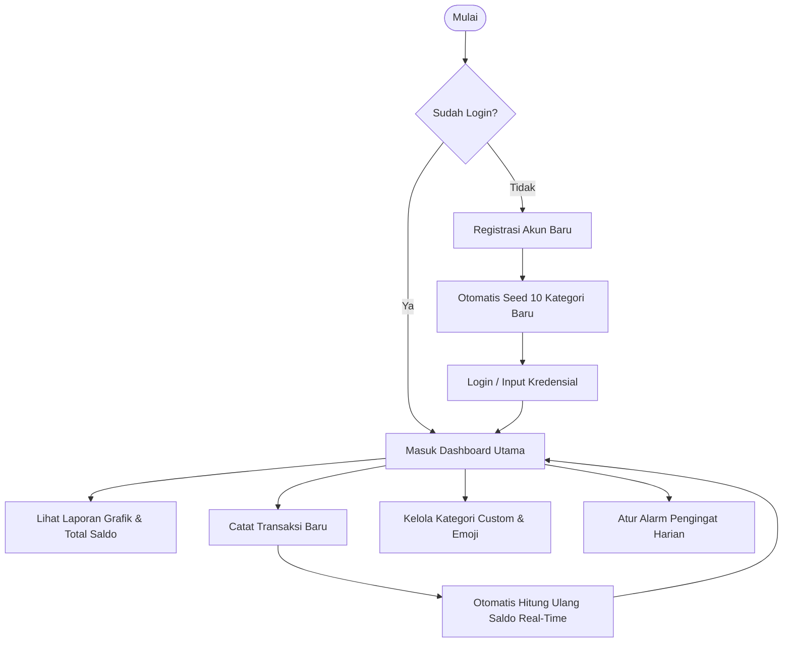
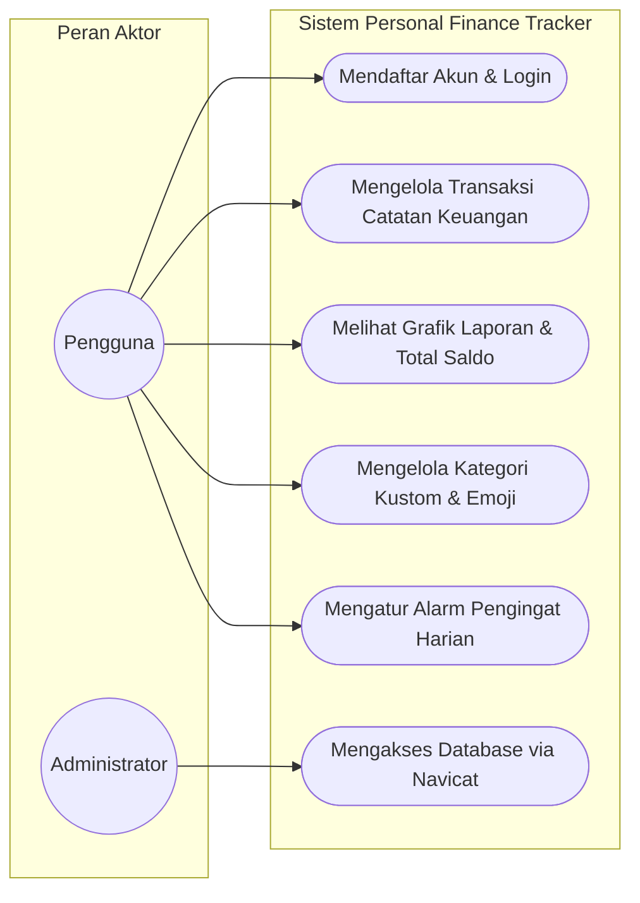

# 🪙 Personal Finance Tracker

Aplikasi pencatatan dan pengelolaan keuangan pribadi modern yang dirancang dengan performa tinggi, tampilan premium gelap (dark mode), visualisasi analitik real-time, serta arsitektur backend yang aman dan tangguh.

Aplikasi ini menggunakan arsitektur microservices modern yang dibungkus rapi di dalam **Docker Compose** dan terintegrasi langsung dengan **Cloudflare Zero Trust (Cloudflare Tunnel)** untuk keamanan SSL dan akses global bebas hambatan.

---

## 🚀 Fitur Utama

- **📊 Dashboard Analitik Interaktif**:
  - Grafik lingkaran (*Pie Chart*) distribusi alokasi pengeluaran berdasarkan kategori.
  - Grafik batang (*Bar Chart*) tren arus kas bulanan selama 6 bulan terakhir.
  - Perhitungan analitik otomatis (Total Pemasukan, Total Pengeluaran, dan Sisa Saldo).
- **💸 Pencatatan Keuangan Real-Time**:
  - Fitur tambah, edit, dan hapus transaksi (Pemasukan & Pengeluaran) secara instan.
  - **Summary Cards**: Kartu total saldo netto dinamis yang berubah warna (Biru/Merah) menyesuaikan kondisi surplus atau defisit.
  - Filter interaktif berdasarkan Bulan, Tahun, dan Tipe Transaksi.
- **🏷️ Kategori Kustom dengan Emoji**:
  - Manajemen kategori pengeluaran dan pemasukan dengan pemilihan emoji (*Emoji Picker*) dan palet warna kustom.
  - Otomatis men-seed **10 Kategori Default** saat pendaftaran akun baru.
- **🔔 Pengingat Harian (Reminders)**:
  - Alarm harian untuk mencatat keuangan yang terintegrasi dengan **Service Worker** dan Notifikasi Browser lokal.
- **🔐 Keamanan & Otentikasi**:
  - Sistem login dan registrasi berbasis **JSON Web Token (JWT)**.
  - Enkripsi password menggunakan **Bcrypt** di sisi backend.
- **🌓 Premium Dark Mode**:
  - UI responsif bertema gelap yang modern berbasis **Tailwind CSS v3** dan palet warna Untitled UI yang memanjakan mata.

---

## 🛠️ Arsitektur Teknologi

### Frontend (Web UI)
- **Framework**: React.js 18 + Vite
- **Styling**: Tailwind CSS v3
- **State Management**: Zustand
- **Visualisasi Grafik**: Recharts
- **Router**: React Router DOM v6
- **Server HTTP**: Nginx (teroptimasi untuk Single Page Application)

### Backend (API Service)
- **Bahasa**: Golang (Go 1.22)
- **Framework**: Gin Gonic (High Performance Router)
- **Database**: MongoDB 7
- **Authentication**: JWT (JSON Web Token)
- **Password Hashing**: Bcrypt

### DevOps & Infrastruktur
- **Containerization**: Docker & Docker Compose (Multi-stage builds)
- **Reverse Proxy / SSL**: Cloudflare Zero Trust (Cloudflare Tunnel)
- **Database Management**: Navicat / MongoDB Compass

---

## 📐 Arsitektur Jaringan (Docker & Cloudflare Tunnel)

Berikut adalah visualisasi alur komunikasi data aman dari internet hingga ke kontainer lokal Anda melalui Cloudflare Tunnel:



---

## 📊 Alur Kerja & Diagram Use Case

### 1. Flowchart Alur Kerja Aplikasi (User Flow)
Berikut adalah bagan alur proses pendaftaran, login, pengolahan otomatis kategori, serta pencatatan transaksi yang dihitung secara real-time:



### 2. Diagram Use Case Sistem
Diagram ini menjelaskan interaksi peran aktor (Pengguna & Administrator) terhadap modul fitur utama yang disediakan sistem:



---

## ⚙️ Persiapan & Instalasi Lokal

### 1. Kloning Repositori
```bash
git clone <url-repository-anda>
cd finance-tracker
```

### 2. Konfigurasi Environment (`.env`)
Salin berkas `.env.example` menjadi `.env` di direktori utama proyek Anda:
```bash
cp .env.example .env
```
Sesuaikan nilai variabel lingkungan di dalam berkas `.env`:
```env
# Arsitektur & Koneksi MongoDB
MONGO_USER=<username_mongodb_anda>
MONGO_PASS=<password_mongodb_anda>
MONGO_DB=<nama_database_anda>
MONGO_PORT=27017

# Konfigurasi Backend & Frontend
PORT=8080
FRONTEND_PORT=80
VITE_API_URL=https://<domain-anda.com>

# Token Cloudflare Zero Trust Anda
CLOUDFLARE_TUNNEL_TOKEN=<token_cloudflare_tunnel_anda>
```

> [!IMPORTANT]
> - Variabel `VITE_API_URL` harus diatur ke domain HTTPS publik Anda agar frontend (yang berjalan di browser pengguna) dapat memanggil backend secara eksternal lewat enkripsi HTTPS Cloudflare.
> - Masukkan token terowongan Cloudflare Anda pada variabel `CLOUDFLARE_TUNNEL_TOKEN`.

---

## 🐳 Menjalankan Aplikasi dengan Docker Compose

Untuk memulai semua layanan (Frontend, Backend, Database MongoDB, dan Cloudflare Tunnel) secara instan dalam satu perintah, jalankan:

```bash
docker compose up -d --build
```

Setelah semua kontainer menyala, status layanan Anda dapat diperiksa dengan perintah:
```bash
docker compose ps
```

---

## 🔌 Menghubungkan Navicat ke Database MongoDB

Gunakan pengaturan berikut pada Navicat untuk mengakses data MongoDB di dalam kontainer Docker secara aman:

### Tab General
- **Connection Name**: `Finance Tracker` (Bebas)
- **Type**: `Standalone`
- **Host**: `localhost` (atau `127.0.0.1`)
- **Port**: `27017`
- **Authentication**: `Password`
- **Authentication Database**: `admin` *(Wajib diisi agar user root diizinkan membaca database)*
- **User Name**: <username_mongodb_anda>
- **Password**: <password_mongodb_anda> *(Sesuai nilai MONGO_PASS di file .env)*

---

## 🛡️ Konfigurasi Cloudflare Zero Trust (Public Hostnames)

Agar aplikasi Anda dapat diakses secara publik dan aman, konfigurasikan **Public Hostnames** di dasbor Cloudflare Zero Trust Anda pada bagian terowongan aktif terkait dengan rute berikut:

1. **Rute Backend (API)**:
   - **Domain / Subdomain**: `<subdomain.domain-anda.com>`
   - **Path**: `api/*`
   - **Service Type**: `HTTP`
   - **URL**: `http://backend:8080`

2. **Rute Frontend (Web UI)**:
   - **Domain / Subdomain**: `<subdomain.domain-anda.com>`
   - **Path**: *(dikosongkan / default `*`)*
   - **Service Type**: `HTTP`
   - **URL**: `http://frontend:80`

---

## 🛠️ Workflow CI/CD (GitHub Actions)

Proyek ini dilengkapi dengan otomatisasi CI/CD tingkat lanjut di berkas `.github/workflows/deploy.yml`:
- **Pemicu**: Setiap kali Anda melakukan `git push` ke cabang utama (`main`).
- **Proses**:
  1. Melakukan testing kode.
  2. Membangun (*build*) image Docker frontend dan backend secara otomatis.
  3. Mengunggah image hasil kompilasi langsung ke **GitHub Container Registry (GHCR)**.
  4. Menghubungi server VPS produksi Anda untuk melakukan penarikan ulang (*pull*) image terbaru dan me-restart layanan secara otomatis tanpa waktu henti (*zero-downtime*).
